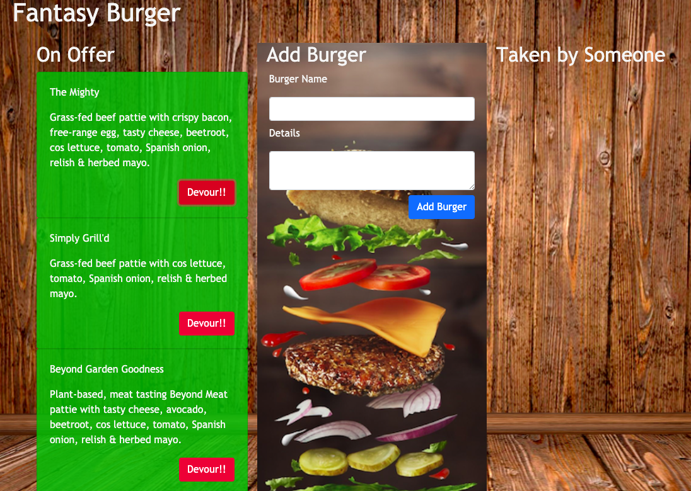

## Title: 
Fantasy Burger

## Description:
Web App for burger fans to create their burger.

## Table of Contents

- [Installation](#installation)
- [Usage](#usage)
- [License](#license)
- [Contributors](#contributing)
- [Testing](#tests)
- [Project Link](#link)

## Installation
Mysql, express-handlebars, express, util
## Usage
Created for burger fans to create and share their fantasy burger.
## License
MIT
## Contributing
PSO Co.
## Tests
none
## Link
https://thawing-oasis-26185.herokuapp.com/

## Contacts
### Author: PangSzee Ong
### Email: null

